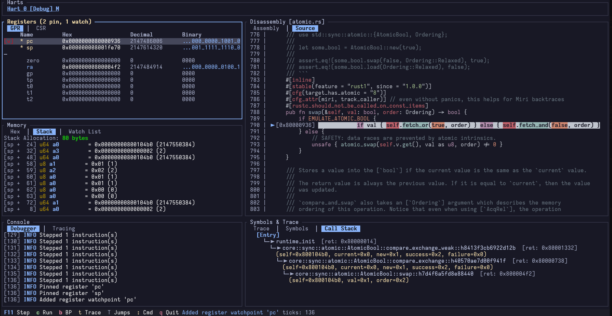
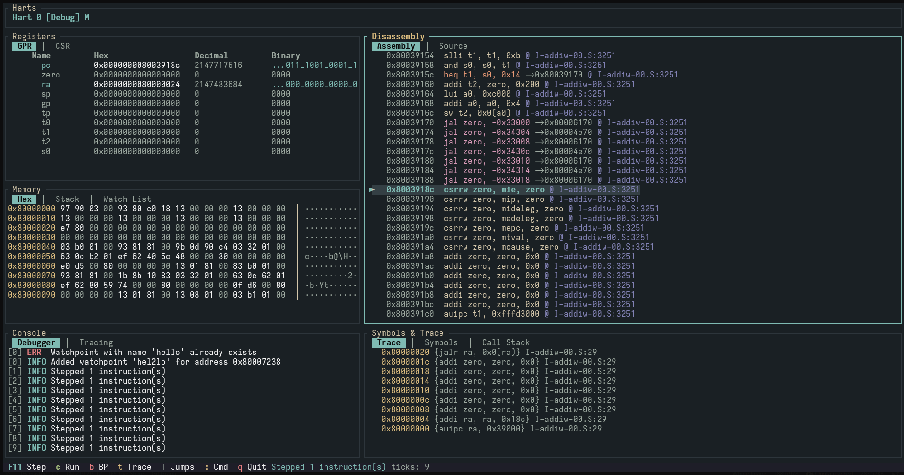

# Xoloria

Xoloria is a nice and compact RISC-V vm. This is made mainly for me to experiment with how os/hardware works under the hood. And also try experiment with custom firmware/os dev a bit.

### NOTE: This is still very much WIP and far from what I want it to be...

Here are some nice screen shots of it in action to fill the README till something meaningful comes in...

